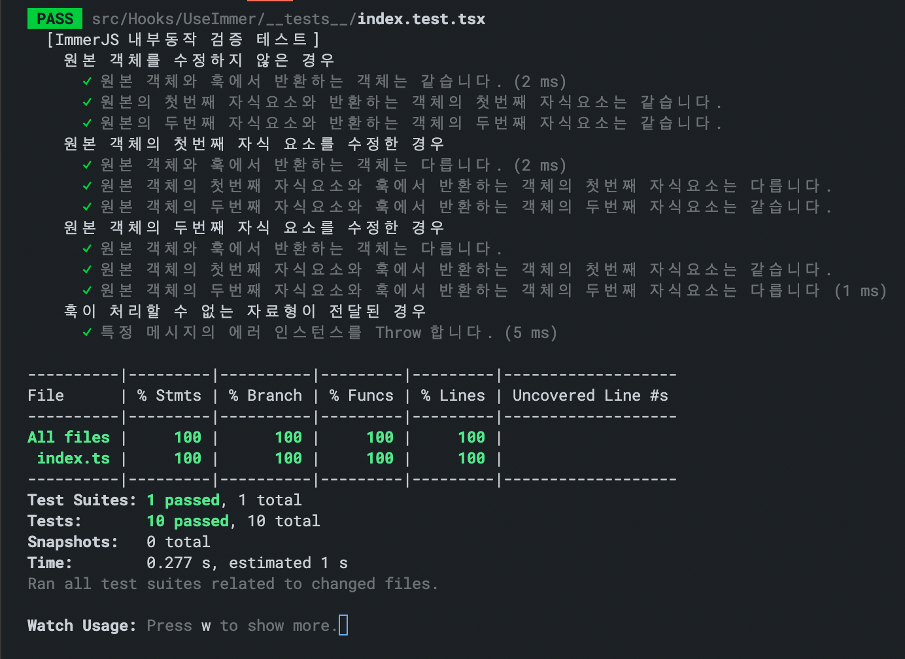
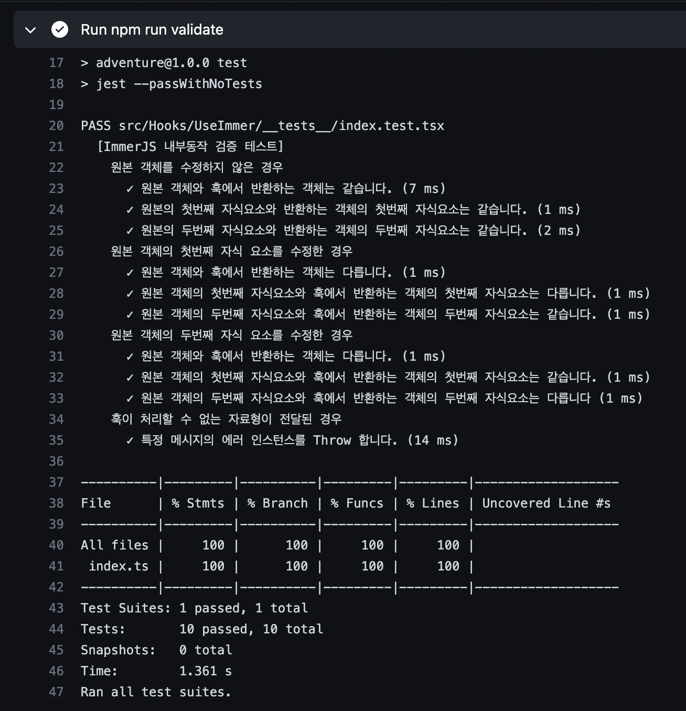

## Retrospect

> 테스트 환경을 구축하고 적용하는 내용이어서, 기왕이면 사이드 프로젝트에 실제로 Jest 의존성을 설치하고 테스트 소스를 작성하는 기회를 갖는게 베스트라고 생각했다.

`Github Actions` 를 통해서 자동화 CI를 수행하게 되는데 이때 테스트를 수행할 수 있는 `NPM Scripts` 가 구성이 되어있습니다.

- @testing-library/react 를 통한 컴포넌트 테스팅
- @testing-library/react-hooks 를 통한 커스텀 리액트 훅 테스팅

위의 두가지 절차를 수행합니다.

|                       Local Test                       |                       CI Test                       |
| :----------------------------------------------------: | :-------------------------------------------------: |
|  |  |

### References

- [React-Hooks-Testing-Library](https://react-hooks-testing-library.com/)

- [React-Hooks-Testing-Library 사용법](https://www.daleseo.com/react-hooks-testing-library/)
